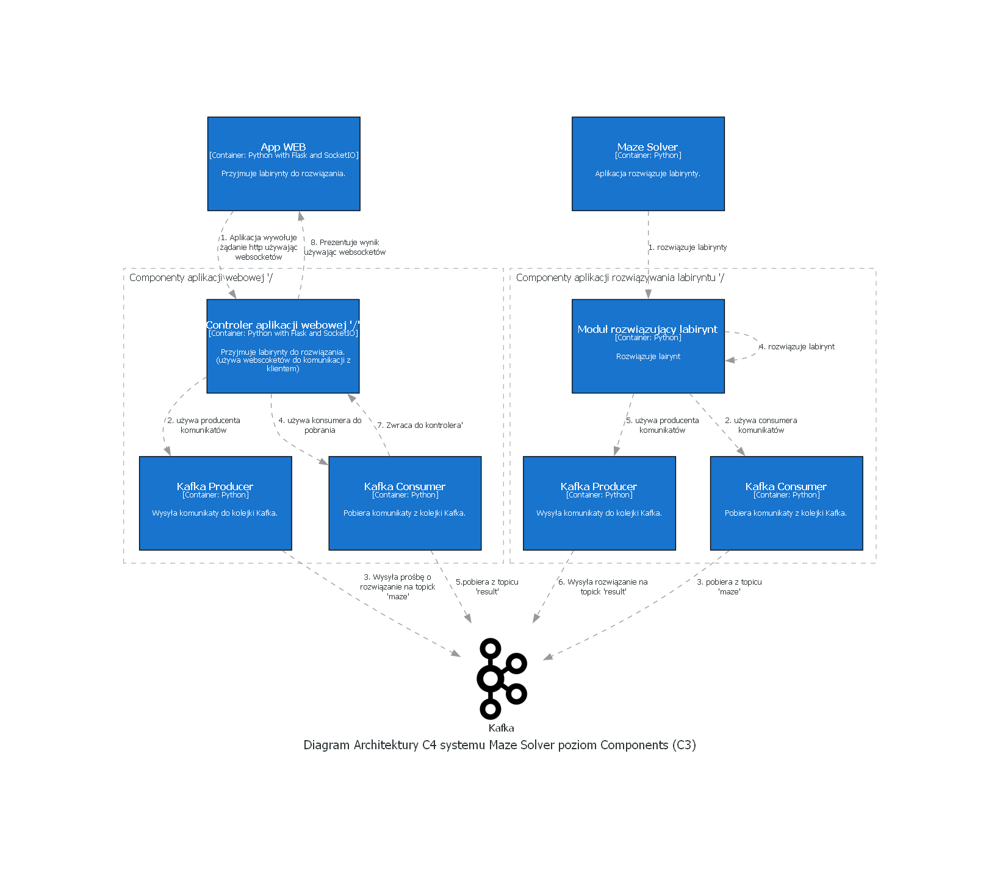

# Maze Solver
Dokumentacja architektury systemu do rowiązywania labiryntów

# Rozwiązanie

Aby poprawnie podejść do problemu należy odpowiedzieć sobie na taką listę pytań:

* Ile użytkowników będzie korzystać z systemu?
* Czy system ma działać w czasie rzeczywistym? Czy odpowiedź będzie natychmiastowa, czy też po pewnym czasie?
* Czy wymaganą są jakieś zabezpieczenia

Aby uzuskać te informacje należy udać się do zródła (osoby odpwiedzialnej za stworzenie iniciatwy) i wypytać ją po powody powstania pomysłu jej założenia i na podstawie takiej rozmowy zaprezentować odpowiednie rozwiązanie. 
Jeśli występują problemy komunikacyjne można zastosować podejście EventStorming.

Poniżej znajduje sie architektura rozwiązania wraz z opisem i wstępną konfiguracją:


## Poziom c1


## Poziom c2


## Poziom c3


## Poziom c4


## Kontenery 
Rozwiązania zostaną wdrożone w formie kontenerów Docker'owych (patrz sekcja Dockerfile dla WEB APP oraz MAZE SOLVER). Tam znajdują się odpowiednio przygo konfiguracje


## Dockerfile dla WEB APP
```zadanie\app-web\Dockerfile```

## Dockerfile dla MAZE SOLVER
```zadanie\app-kafka\Dockerfile```

## Kubernetes configuration dla WEB APP

rozwiązanie będzie skalowalne dlatego przygotowano odpowiednią konfiguracje kubernetes dla deploymentu i serwiów:

### Kubernetes configuration dla WEB APP

```
zadanie\app-kafka\deployment.yaml
zadanie\app-kafka\service.yaml


  apiVersion: apps/v1
  kind: Deployment
  metadata:
    name: app-web
  spec:
    replicas: 1
    selector:
      matchLabels:
        app: app-web
    template:
      metadata:
        labels:
          app: app-web
      spec:
        containers:
        - name: app-web
          image: maze-app-web
          ports:
          - containerPort: 5000
```


### Kubernetes configuration dla MAZE SOLVER
```
zadanie\app-kafka\deployment.yaml
zadanie\app-kafka\service.yaml

 apiVersion: apps/v1
  kind: Deployment
  metadata:
    name: app-kafka
  spec:
    replicas: 5
    selector:
      matchLabels:
        app: app-kafka
    template:
      metadata:
        labels:
          app: app-kafka
      spec:
        containers:
        - name: app-kafka
          image: maze-app-kafka
          ports:
          - containerPort: 9092
  
```

## Setup projektu techniczny (pomiń dla spokoju)

### Wymagane oprogramowanie

* Python <https://www.python.org/>
* Visual Studio Code <https://code.visualstudio.com/>
* Marp for VS Code <https://github.com/marp-team/marp-vscode>
* Visual Studio Community <https://visualstudio.microsoft.com/pl/> (ze względu na jedną z bibliotek)

### Utwórz projekt w vscode na podstawie tego repozytorium
<https://github.com/lukevito/maze>

### Następnie będąc głównym katalogu projektu otwórz konsole i utwórz srodowisko

```
python -m venv myenv
```

### Aktywuj srodowisko

```
myenv\Scripts\activate
```

### Zainstaluj biblioteki

```
python -m pip install -r .\requirements.txt
```

## Generowanie diagramów architektury

```
python.exe .\architecture.py
```

## Generowanie wpisu w Architecture Decision Record

```
adr-new create equal animals
```

listowanie decyzji

```
adr-list
doc/adr/0001-record-architecture-decisions.md
doc/adr/0002-create-equal-animals.md
```

## Generowanie prezentacji (Visual Studio Code)
 