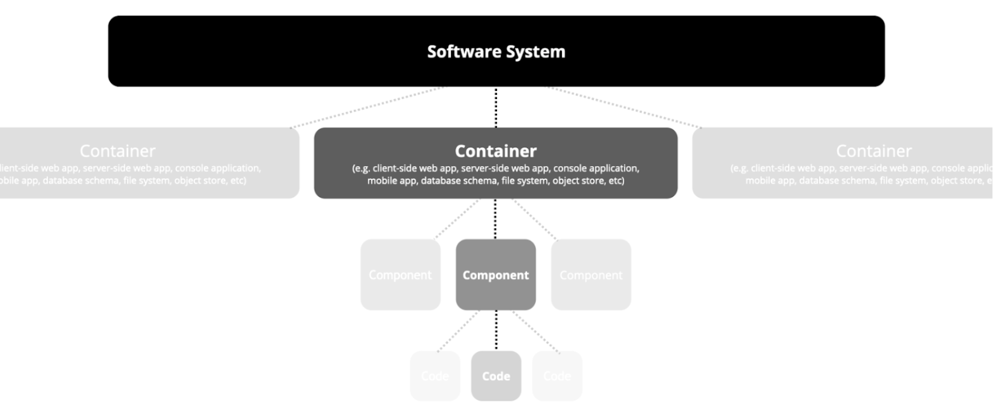
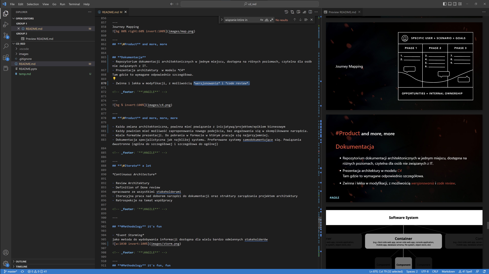
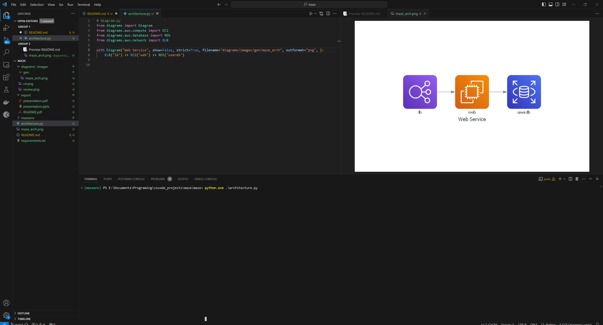

# Zadanie

Stworzenie dokumentacji architektonicznej do systemu **Maze Solver**, udostępniającego możliwość rozwiązywania *labirytnu*.

---

## Pytania do zaadresowania

* Ile użytkowników będzie korzystać z systemu?
* Jak użytkownik wprowadzi labirynt? Jaki jest format danych wejściowych (obraz, pliki z danymi)?
* Czy system ma działać w czasie rzeczywistym? Czy odpowiedź będzie natychmiastowa, czy też po pewnym czasie?
* Jaki format ma mieć odpowiedź? Czy użytkownik ma otrzymać obraz, czy też informacje tekstową dotyczącą kroków do rozwiązania labiryntu?

---

## Następne kroki

Po otrzymaniu odpowiedzi przygotuje odpowiednie diagramy, rejestr decyzji architektonicznych oraz finalną prezentacje

```architecture.pdf```

---

## Projekt Rozwiązania
<https://github.com/lukevito/maze>

---

## Model opisu architektury

Prezentacja architektury systemu Maze Solver  w modelu **C4**
<https://c4model.com/>

---

## Dokumentacja Maze Solver

<https://github.com/lukevito/maze/architecture.pdf>

Repozytorium dokumentacji architektonicznych systemu **Maze Solver**, dostępna na różnych poziomach C4.

---

## Funkcjonalnośc dokumentacji systemu 
(Dokumentacja Dokumentacji Maze Solver)

---

### Generowanie diagramów

Możliwość generowania diagramów modelu architektury (zobacz katalog **doc\diagrams**)
 <https://diagrams.mingrammer.com/>
*Formaty: png, img*

---

#### Polecenie generowania diagramów

```
python.exe .\architecture.py
```

---

#### Przykładowy diagram

TODO:

---

### Architecture Decision Record

Każda zmiana architektoniczna, powinna mieć powiązanie z **Architecture Decision Record** (zobacz katalog **doc\adr**)

---

### Polecenie generowania wpisu w ADR

```
adr-new utworzenie dokumentacji pierwsze kroki
```

***Utworzy plik zawierający decyzje architektoniczną***

---

```
# 2. Utworzenie dokumentacji pierwsze kroki

Date: 2024-02-12

## Status

Do Akceptacji

## Context

Potrzeba utworzenia projektu do dokumentacji systemu Maze Solver

Założenia:

- dokumentacja będzie posiadać rejestr ADR (DONE)
- dokumentacja będzie dostępna w różnych formatach
- dokumentacja będzie zwinna i lekka w modyfikacji, z możliwością *wersjonowania* i *code review*.


The issue motivating this decision, and any context that influences or constrains the decision.

## Decision

Wybrane narzędzia:
Python
Diagrams (python lib)
Marp

Docelowy model:
C4

## Consequences

- Wymagana znajomość podstaw języka python
- Wymagana integracja z Enterprise Architect
```

***0002-utworzenie-dokumentacji-pierwsze-kroki.md***

---

## Dodatki

---

### Prezentacja architektury

Możliwość generowania prezentacji z modelu architektury
 <https://marp.app/>
*Formaty: PowerPoint, HTML, PDF, png*
(zobacz katalog **doc/presentations/export**)


---

#### Generowanie prezentacji (doc/presentations/zadanie.md)


---

Prezentacja na którą patrzysz powstała przy użyciu tego narzędzia

---


<!-- _footer: '**https://c4model.com/**' -->

---


<!-- _footer: '**https://marp.app/**' -->

---


<!-- _footer: '**https://github.com/mingrammer/diagrams**' -->
